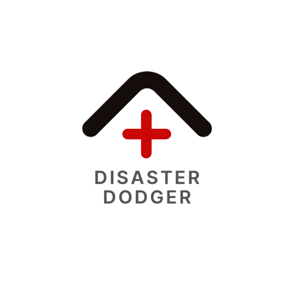

# Disaster Dodger

Created for MLH's OneHacks II.

## Description

Our app allows you to select the state you live in to find the most common natural disasters that occur in your area. It then recommends you a curated list of items you need to prepare yourself.

## How we built it
We build the frontend using React and Material UI and the backend with Flask. They communicate with each other through HTTP requests and the server fetches API data from OpenFema, a government API about natural disasters.

#### Aim
We always felt so powerless when other people across the globe were suffering from natural disasters. They're unpredictable and can ruin someone's entire livelihood. The 2021 Mansfield earthquake in Australia is a prime example where people don't necessarily prepare for one since, they don't occur much there. So when we remembered about the 5.9 magnitude earthquake striking, we knew we had to make something that can help everyone prepare and rebuild their community.

## Roadmap

We understand that preventative measures aren't enough so we want to implement more reactionary ones. We understand that when a disaster does strike, people are panicked and don't know what to do, so we want to be able to find the nearest disaster shelter to your location. We also want to have a login feature where it tracks what items you have bought and sends you a reminder when your disaster kit has expired items so you can replenish it.

#### Automatic Supplies Update

System will automatically update listings for emergency supplies and reflect the updates to users.

#### User Accounts

Users can receive reminder notifications to replace near-expiratory supplies, such as emergency water and rations.

## Authors
Han Li: Front End Dev, UX/UI

Kimmy Yan: Wireframing/Prototyping, UX/UI, Team Branding

Ryan Yi: Back End Dev

Cindy (Rin) Li: Content Research, Design, Team Branding

