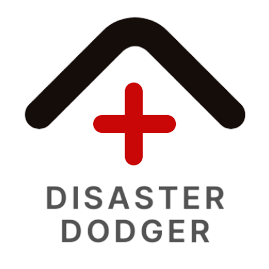

# Disaster Dodger

Created for MLH's OneHacks II.

## Description

Our app allows you to select the state you live in to find the most common natural disasters that occur in your area. It then recommends you a curated list of items you need to prepare yourself.

#### Aim
It is our aim to assist in safer evacuation during potential catastrophe by providing accurate, comprehensive, and accessible information concerning natural disaster preparation.

## Roadmap

We have several future plans for this project.

#### Automatic Supplies Update

System will automatically update listings for emergency supplies and reflect the updates to users.

#### User Accounts

Users can receive reminder notifications to replace near-expiratory supplies, such as emergency water and rations.

## Authors
Han Li: Front End Dev, UX/UI

Kimmy Yan: Wireframing/Prototyping, UX/UI, Team Branding

Ryan Yi: Back End Dev

Cindy (Rin) Li: Content Research, Design, Team Branding

